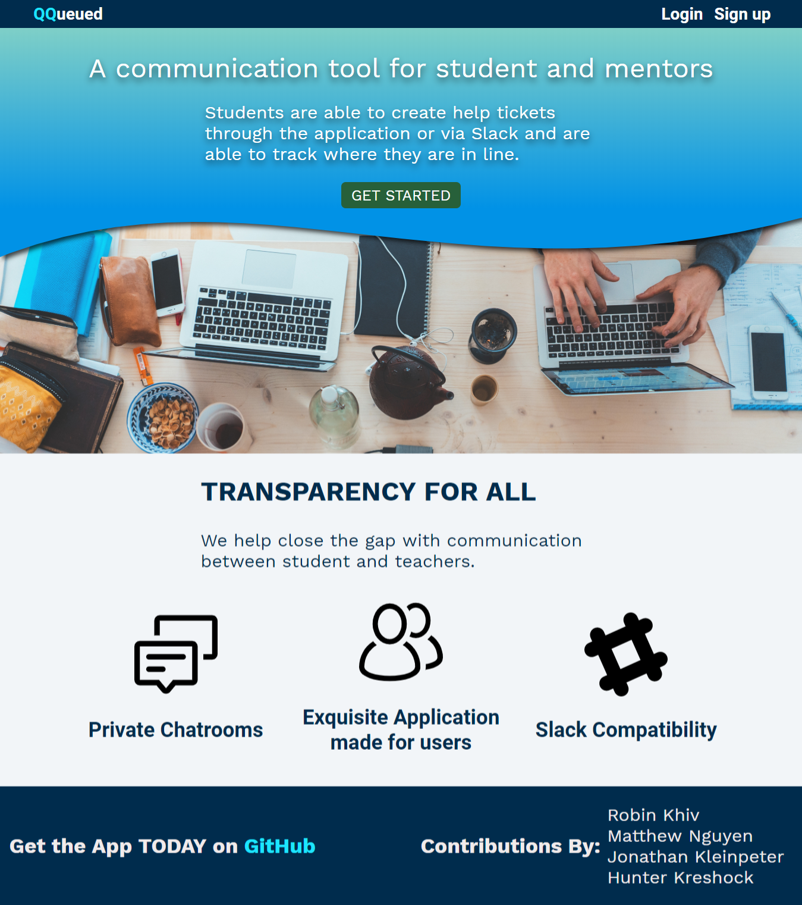
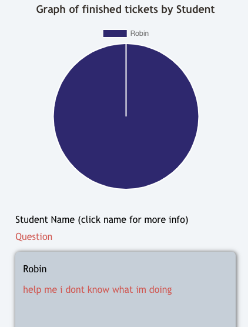
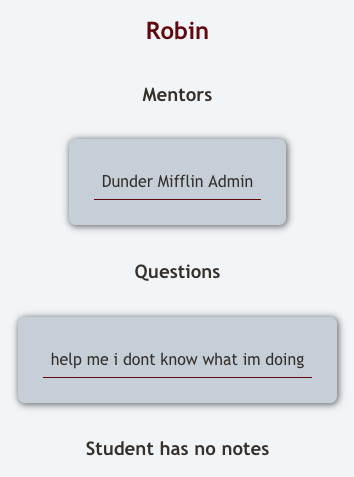
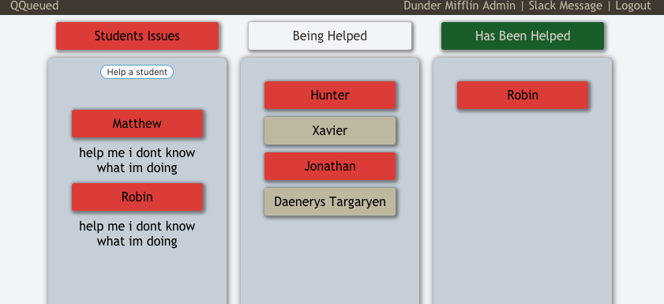
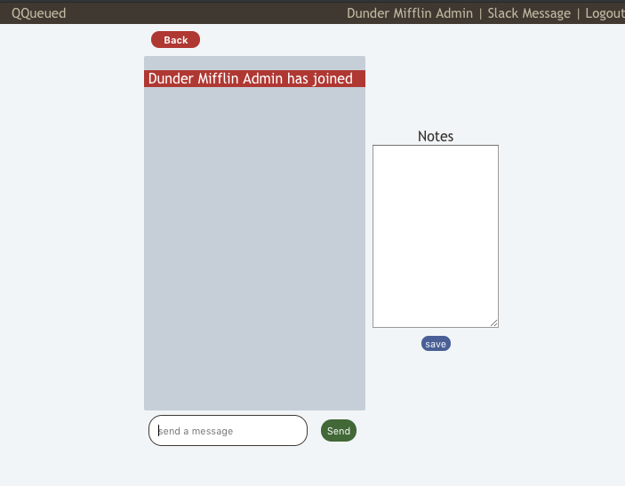

# QQueued

**Application was made by Hunter Kreshock, Jonathan Kleinpeter, Matthew Nguyen and Robin Khiv**

[Demo](http://qqueued-mentoring.now.sh)  
[Client Repo](https://github.com/thinkful-ei-armadillo/QQueued-client)  
[Server Repo](https://github.com/thinkful-ei-armadillo/QQueued-server)  

*You can use the follow credentials to demo our application.*  

Username: admin   
Password: pass   

**Important**: if you wish to you the Slack integration, your username on the application __must__ match your Slack handle.  

  



## Summary      

This is your new tool to help deal with communication between students and mentors. Student are able to create help tickets through the application, or Slack, and are able to track where they are in line. The application is a visual queue, allowing mentors to be even more transparent with the students in the sense that the students will now know where the mentors are.  

## Getting Started  
Client:    
```
git clone https://github.com/thinkful-ei-armadillo/QQueued-client  
cd QQueued-client  
npm install  
```  
Server:  
```
git clone https://github.com/thinkful-ei-armadillo/QQueued-server  
cd QQueued-server  
npm install  
npm run migrate  
```  

## Slack Commands  
Creating a help ticket:  
```
/help-me [insert question]
``` 
Under Apps, direct message wenc the bot either command to get position in queue:
```
queue or ticket
```

## API Endpoints  
```
POST /api/auth  
PUT /api/auth  

GET /api/data  
GET /api/data/note  
POST /api/data/note/:noteID  

GET /api/queue  
POST /api/queue  
PATCH /api/queue  
PATCH /api/queue/:sessionID  
DELETE /api/queue/:sessionID 
```
## Tech Used  
*Front-End:*  
* React

*Back-End:*   
* Node.js 
* Express.js  
* Postgresql  
* socket.io  
* Slack API  

*Dev-Tools*  
* ZEIT  
* Heroku  
* ngrok  

 


